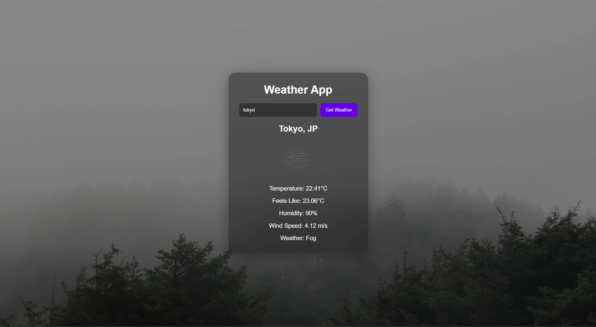

# Weather App 🌦️

A responsive weather application built using HTML, CSS, and JavaScript that fetches real-time weather data from the OpenWeatherMap API.

The application allows users to search for any city and view:

- Current temperature
- Feels-like temperature
- Humidity
- Wind speed
- Weather condition
- Weather icon

The app also dynamically changes background images based on the current weather condition.

---

## Features

- Search weather by city name
- Real-time weather information
- Dynamic weather background images
- Weather icons
- Temperature display
- Feels-like temperature
- Humidity display
- Wind speed display
- Error handling for invalid city names
- Responsive design
- Enter key support

---

## Technologies Used

- HTML5
- CSS3
- JavaScript
- OpenWeatherMap API

---

## Project Structure

```bash
weather-app/
│
├── images/
├── index.html
├── styles.css
├── script.js
├── screenshot.png
└── README.md
```

---

## Screenshot



---

## Setup Instructions

1. Clone the repository

```bash
git clone YOUR_GITHUB_REPOSITORY_LINK
```

2. Open the project folder

3. Add your API key inside `script.js`

```javascript
const API_KEY = "YOUR_API_KEY";
```

4. Open `index.html` using Live Server in VS Code

---

## API Used

OpenWeatherMap API

---

## Getting an API Key

1. Create an account on OpenWeatherMap
2. Generate a free API key
3. Replace the placeholder inside `script.js`

```javascript
const API_KEY = "YOUR_API_KEY";
```

OpenWeatherMap Website:
https://openweathermap.org/api

## Author

Sudhishna Mallavarapu